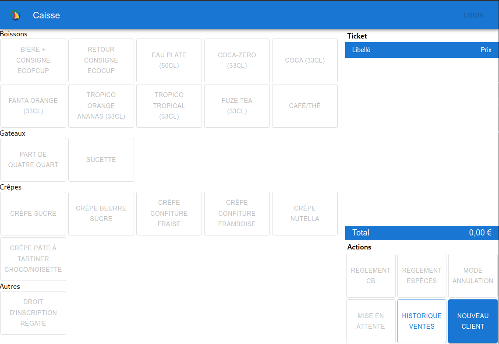
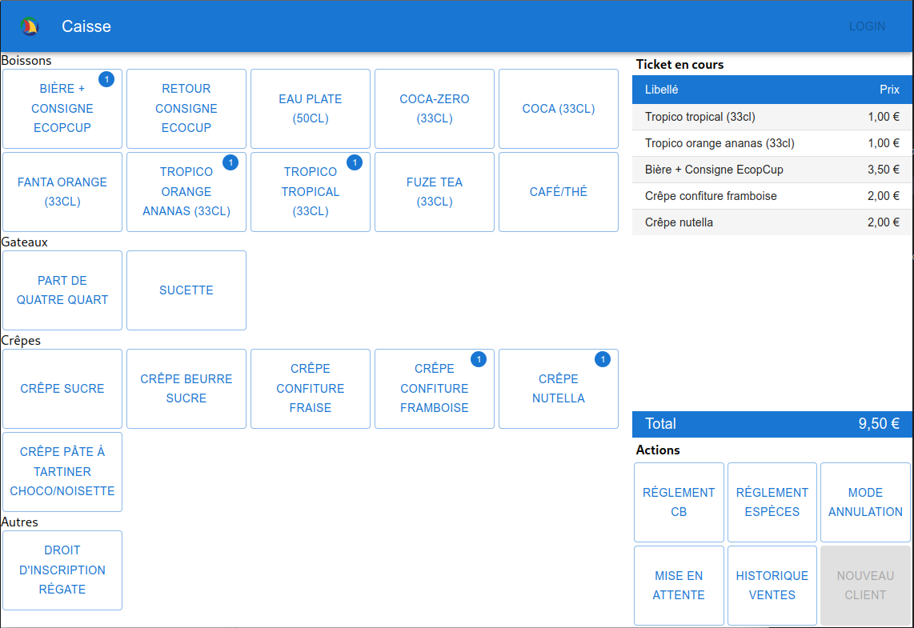
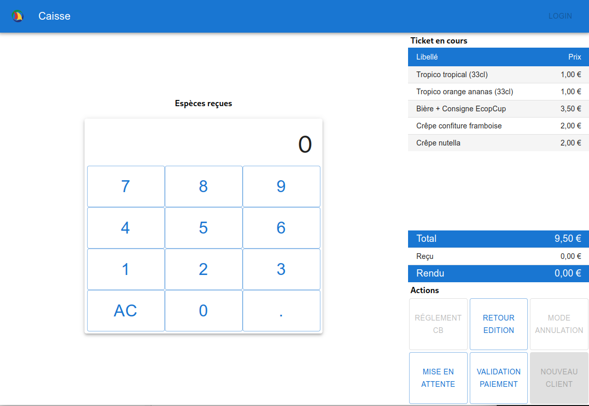
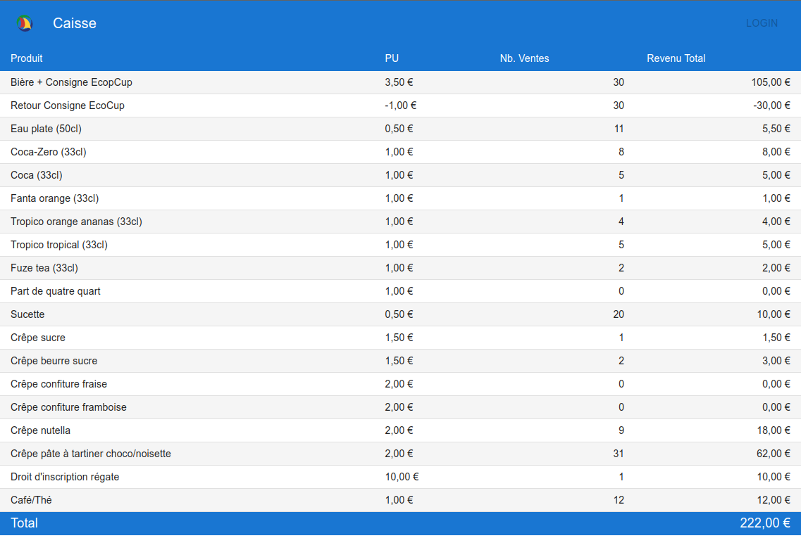
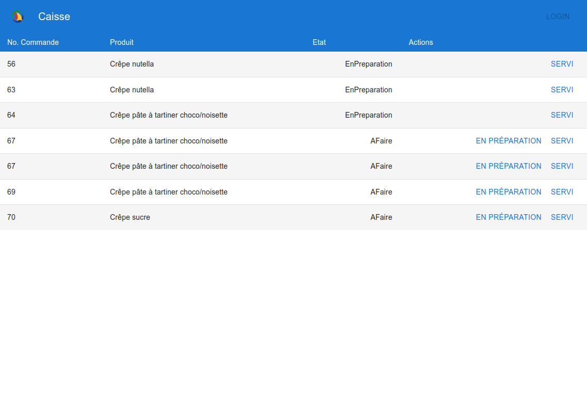

# :en: Mini sales point project designed for use during events organisez by the sailing school
# :fr: Projet de mini caisse enregistreuse pour les evenements de l'association

# Requirements
- Frontend : NodeJS v14+
- Backend : PHP v7+ with PDO-Sqlite driver active
- POS Driver : Python 3 + Requirements (windows or linux)

# Screenshot







# Installation

Check the requirements (for all 3 modules)

``` 
cd caisse
npm install
```

(On windows, you need to specifically install the windows requirements)
``` 
cd caisse/pos-driver
pip3 install -r requirements-windows.txt
```

# Usage

Run all 3 modules from the root dir : 
``` 
cd caisse
npm start
```

# Structure

- Frontend : React-based app handling all user interactions
- Backend : PHP api handling fetching and saving data to database
- POS Driver : Python module connecting to an Ingenico Desk/5000 Point of Sale, used for card-payments (debit or credit).

# Known Issues
- No auth at the moment
- No environement injected configuration (e.g. disabling POS)

# Future plans
- Implement OAuth2 or Auth0 for authentication mecanism
- Product Edition
- Different user rights with different priviledges
- Better handling of transaction logs (POS logs, cash payements, ...)